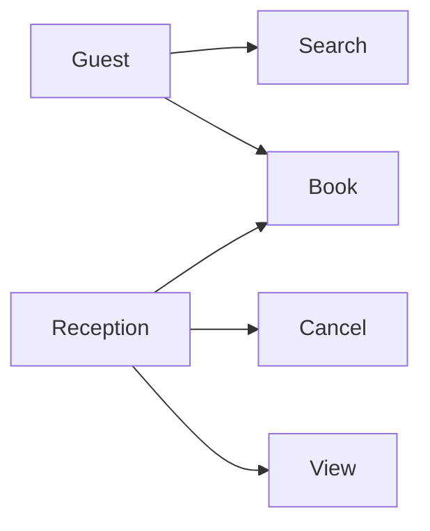
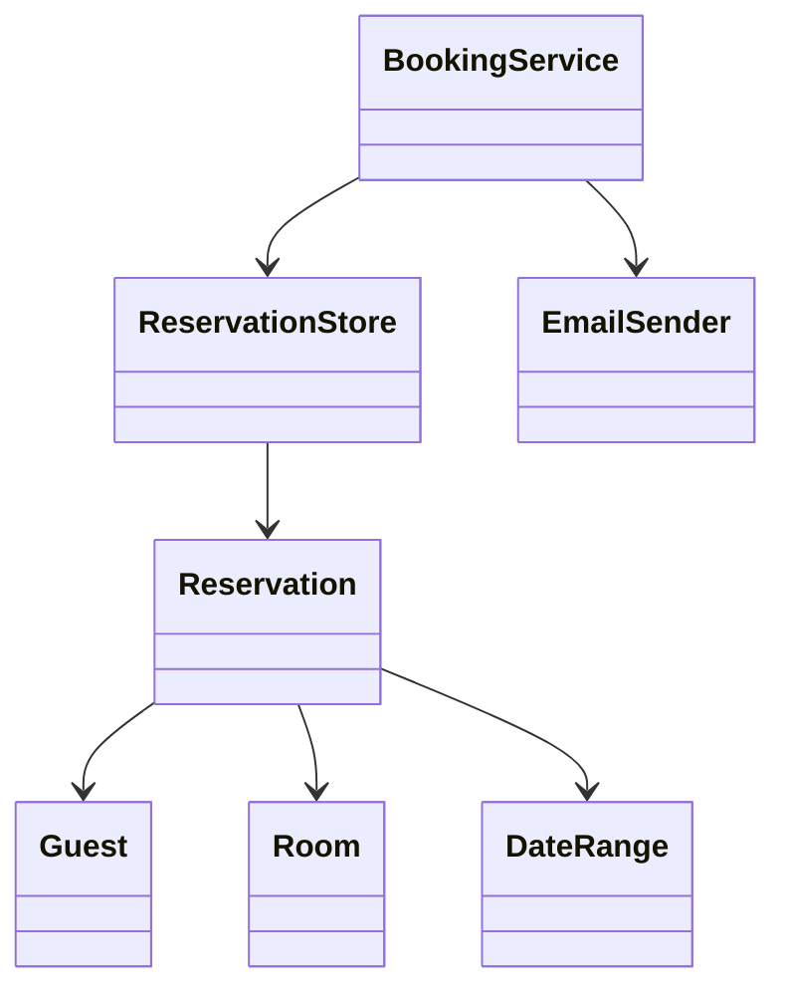
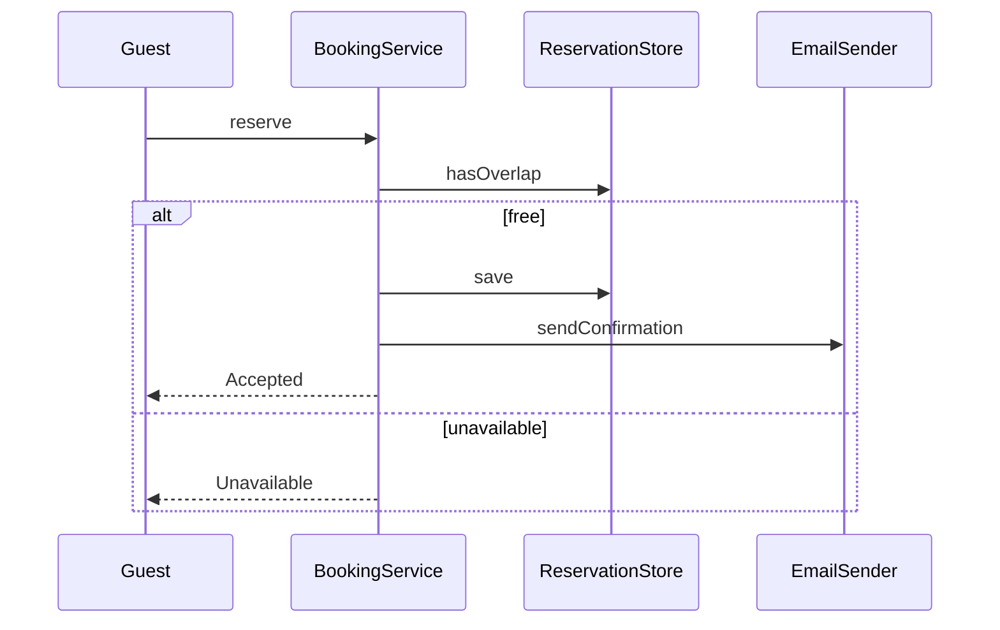
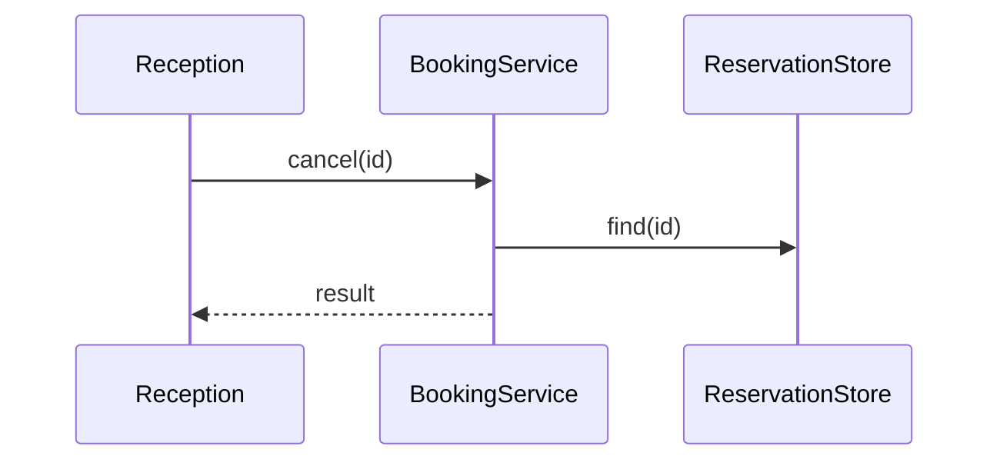
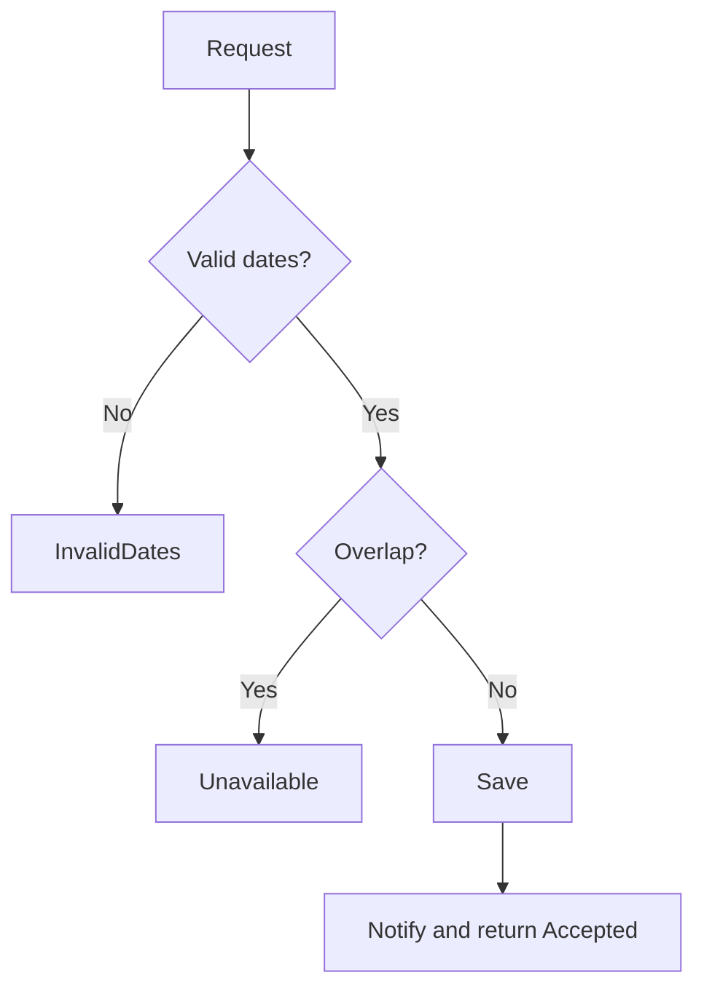

# UML diagrams (Mermaid)
## Use cases

```mermaid
flowchart LR
 Guest --> Search
 Guest --> Book
 Reception --> Book
 Reception --> Cancel
 Reception --> View
```
## Classes

```mermaid
classDiagram
 BookingService --> ReservationStore
 BookingService --> EmailSender
 ReservationStore --> Reservation
 Reservation --> Guest
 Reservation --> Room
 Reservation --> DateRange
```
## Sequence - book

```mermaid
sequenceDiagram
 Guest->>BookingService: reserve
 BookingService->>ReservationStore: hasOverlap
 alt free
 BookingService->>ReservationStore: save
 BookingService->>EmailSender: sendConfirmation
 BookingService-->>Guest: Accepted
 else unavailable
 BookingService-->>Guest: Unavailable
 end
```
## Sequence - cancel

```mermaid
sequenceDiagram
 Reception->>BookingService: cancel(id)
 BookingService->>ReservationStore: find(id)
 BookingService-->>Reception: result
```
## Activity - book

```mermaid
flowchart TD
 A[Request] --> B{Valid dates?}
 B -- No --> C[InvalidDates]
 B -- Yes --> D{Overlap?}
 D -- Yes --> E[Unavailable]
 D -- No --> F[Save]
 F --> G[Notify and return Accepted]
```
